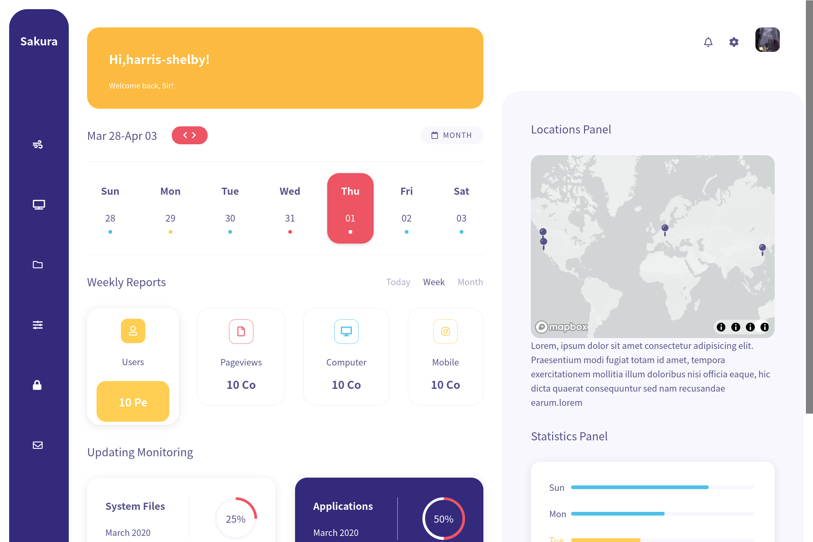
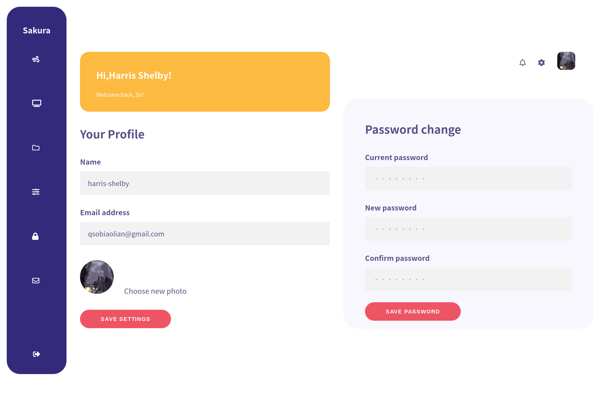

  
  <h1 align="center">
    Prime Particle
  </h1>

 

  
  

**Introduction**

Hi there👋.This project is my first MVC Application,which is applied to various programming languages such as nodejs mongondb sass and pug.I hope this project can be as cool as the name "Prime Particle".So fighting✊!